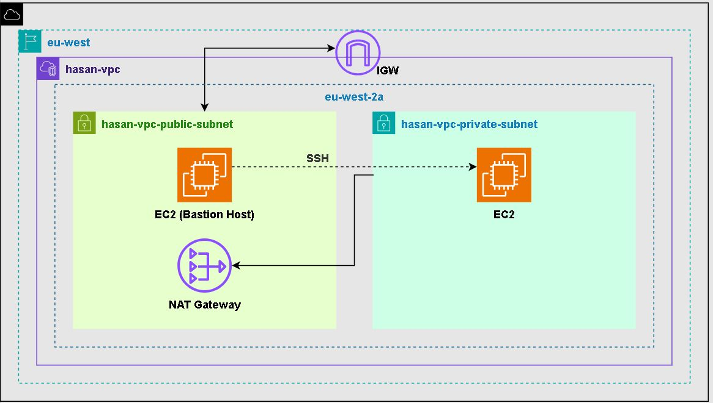

# Custom AWS VPC with Public and Private Subnets

This project builds a production style VPC layout with network isolation, controlled internet access, and a secure path for reaching private resources. It introduces the core ideas behind cloud networking that real environments rely on.

## Architecture Diagram

This diagram shows the full layout including the VPC, subnet structure, routing, traffic flow, internet access components, and the public instance that serves as a bastion host to access the private instance via SSH.

## Overview

The goal was to create a custom VPC that separates public facing resources from internal ones while keeping everything reachable in a controlled and secure way. The setup includes public and private subnets, an Internet Gateway, a NAT Gateway, and routing rules that keep the private subnet isolated. Access into the private layer is designed to go through a bastion host rather than exposing anything directly to the internet for added protection.

## VPC Components

- **Public and Private Subnets**  
  Public subnet handles inbound traffic and outbound internet access.  
  Private subnet remains isolated from the internet while retaining controlled outbound access through a NAT Gateway.

- **Internet Gateway**  
  Allows public subnet resources to reach the internet.

- **NAT Gateway**  
  Placed in the public subnet to allow private resources outbound internet access without exposing them to inbound traffic.

- **EC2 Instance**  
  One EC2 instance is deployed in the public subnet and one in the private subnet.
  The public instance serves as the entry point for managing anything inside the VPC and acts as a bastion host for access into the private instance via SSH.

- **Route Tables and Security Groups**  
  Separate route tables for each subnet to ensure traffic flows correctly.  
  Security groups prevent unnecessary exposure.

## Design Reasoning

This kind of layout mirrors real environments where security and segmentation are essential. Even small projects benefit from separating public and private layers. It limits the blast radius of any compromise and reinforces the idea of least privilege and defence in depth.
